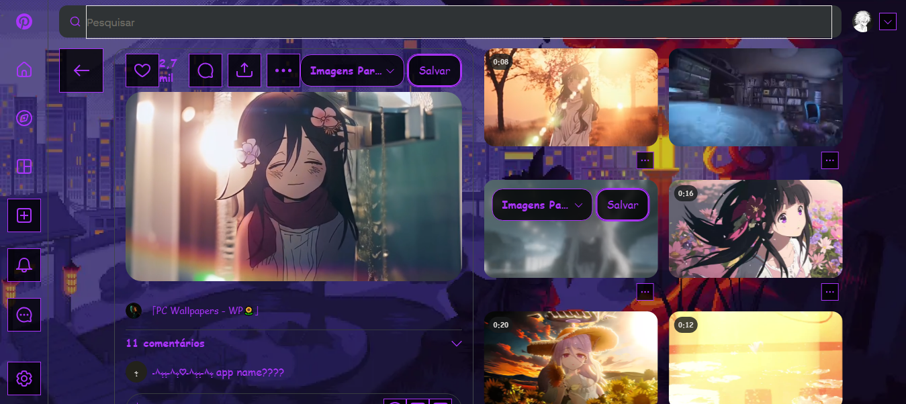
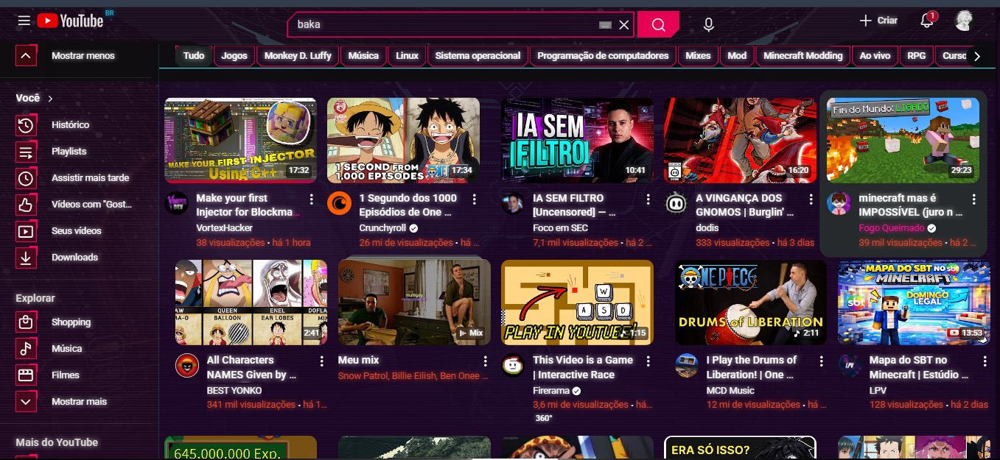
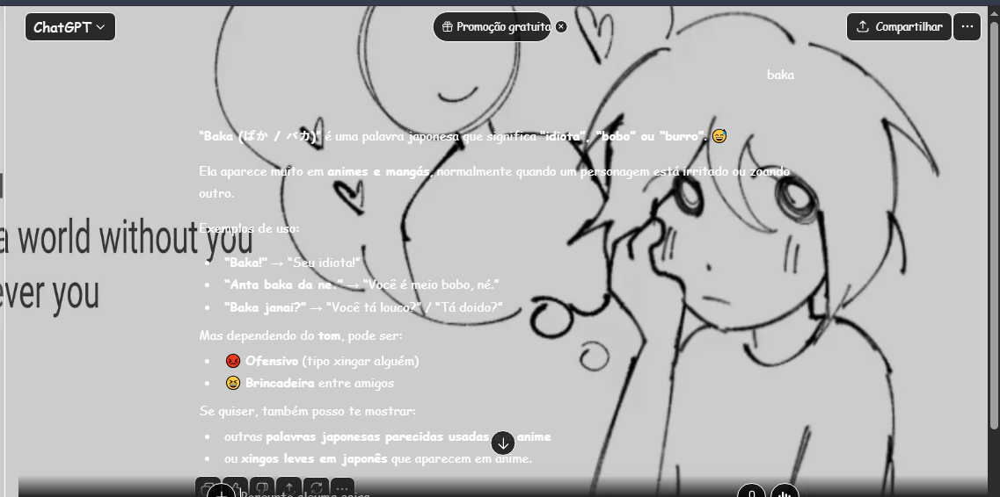
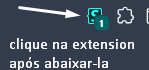
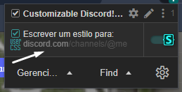

<h1 align="center">Stylus Themes & Resources</h1>

Archive • CSS Themes • Stylus Resources

Este repositório existe para armazenar recursos, exemplos e pequenos
tutoriais relacionados ao uso da extensão Stylus.

A ideia é manter um local simples onde seja possível guardar:

• exemplos de CSS  
• imagens, GIFs e vídeos utilizados em estilos  
• pequenos tutoriais  
• experimentos visuais  
• recursos utilizados para customização de sites  

Também funciona como um pequeno arquivo pessoal para facilitar
a criação ou modificação de estilos para diferentes sites.

SOBRE A EXTENSÃO STYLUS:

Stylus é uma extensão de navegador que permite aplicar CSS
personalizado em praticamente qualquer site.

Isso significa que é possível modificar aparência, cores,
layout ou esconder elementos de páginas específicas.

Alguns usos comuns:

• criar temas escuros  
• alterar cores da interface  
• remover elementos indesejados  
• modificar layout de páginas  
• criar temas completos para sites

INSTALAÇÃO:

Instale a extensão Stylus no navegador.

Chrome / Chromium  
https://chromewebstore.google.com/detail/stylus/clngdbkpkpeebahjckkjfobafhncgmne

Firefox  
https://addons.mozilla.org/firefox/addon/styl-us/

Após instalar, o ícone da extensão ficará disponível
na barra do navegador.

CRIANDO UM ESTILO PARA UM SITE:

1. Abra o site que deseja modificar.

2. Clique no ícone da extensão Stylus.

3. Selecione a opção:

   "Escrever um estilo para: [site]"

4. O editor de CSS será aberto.

5. Escreva o código CSS desejado.

6. Salve o estilo.

Depois de salvo, o estilo será aplicado automaticamente
sempre que o site for aberto.

PREVIEW:

Alguns exemplos de estilos disponíveis no repositório.

TUTORIAL — CRIANDO SEU PRÓPRIO ESTILO:

Abaixo está um pequeno guia visual mostrando como criar
seu próprio estilo usando a extensão Stylus.

As imagens utilizadas neste tutorial estão na pasta:

Images/Tutorial/

Screenshot_1

Clique no ícone da extensão Stylus na barra do navegador.

Screenshot_2

Após clicar na extensão, um pequeno menu será exibido.

IMPORTANTE

Certifique-se de que a caixa verde esteja ativada para evitar
qualquer erro ao aplicar o estilo.

Logo abaixo aparecerá a opção:

"Escrever um estilo para: [site]"

Clique nessa opção para abrir o editor de estilos.

Screenshot_3

Agora você pode começar a criar seu próprio estilo.

Caso esteja criando um estilo do zero, sempre mantenha
o domínio correto do site no campo **domain**.

Exemplos:

google.com  
https://google.com

Isso garante que o estilo será aplicado apenas ao site correto.

USANDO ESTILOS DESTE REPOSITÓRIO

Caso queira usar um estilo já pronto, acesse a pasta:

Themes-websites/

Selecione o site desejado, copie o código do estilo
e cole no editor do Stylus.

IMPORTANTE

Os estilos disponíveis foram criados apenas como exemplos
ou testes de customização.

Caso algo não funcione corretamente, basta editar o domínio
do site ou alterar os links das imagens ou vídeos utilizados.

ADICIONANDO IMAGENS OU GIFS:

Você pode usar imagens ou GIFs dentro do CSS utilizando
links diretos de mídia.

Método 1 — Usando Giphy

1. Acesse https://giphy.com  
2. Escolha o GIF desejado  
3. Copie o link direto da mídia  

Exemplo:

https://media.giphy.com/media/exemplo.gif

IMPORTANTE

Alguns sites podem não aceitar determinados domínios de mídia.
Caso isso aconteça, utilize uma imagem hospedada neste próprio
repositório.

Método 2 — Usando imagens do repositório

1. Acesse a pasta Backgrounds  
2. Clique na imagem desejada  
3. Abra a imagem em uma nova guia  
4. Copie o link direto da imagem  

Exemplo de link direto:

https://raw.githubusercontent.com/l3shzn/Stylus-Themes-Websites/main/Backgrounds/exemplo.webp

Esse tipo de link funciona diretamente dentro do CSS.

Screenshot_4:

Alguns estilos deste repositório possuem um pequeno
menu de configuração dentro do próprio Stylus.

Esse menu permite alterar algumas opções do tema
sem precisar abrir o editor de CSS.

O exemplo mostrado foi feito para Discord,
mas a ideia pode ser adaptada para qualquer site.

Caso queira copiar ou modificar o estilo,
sinta-se livre para usar como base.

ESTRUTURA DO REPOSITÓRIO:

Stylus-Themes-Websites
│
├─ README.md
│
├─ Images
│  ├─ Preview
│  └─ Tutorial
│
├─ Backgrounds
│
└─ Themes-websites

Images/

Contém imagens utilizadas no README.

Preview/  
Mostra exemplos visuais dos estilos.

Tutorial/  
Screenshots utilizados no guia de uso.

Backgrounds/

Arquivos de mídia utilizados nos estilos CSS
(imagens, GIFs ou vídeos).

Themes-websites/

Estilos CSS organizados por site.

NOTA:

Este repositório existe apenas para compartilhar recursos,
exemplos e estilos utilizados com a extensão Stylus.

Alguns estilos foram adaptados de estilos públicos,
outros foram utilizados como base para criar variações
ou experimentos visuais.

Nem todos os estilos foram escritos manualmente do zero.
Alguns foram combinados, modificados ou utilizados
apenas como referência para novos temas.

O objetivo deste repositório é apenas compartilhar
recursos e facilitar customizações visuais com Stylus.

---

Repository created for Stylus customization and theme experimentation.

